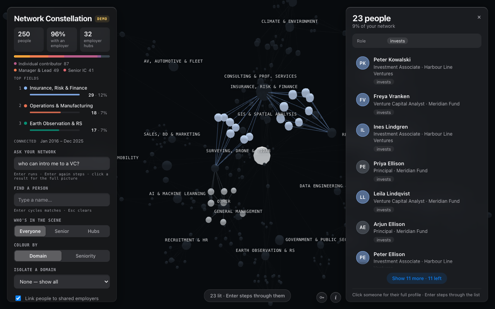

# Network Constellation

A 3D map of your LinkedIn network, arranged by what people actually do. Drop
your export into the page and every connection becomes a node, pulled toward the
domain their job puts them in and toward any employer they share with someone
else. Then you can ask it questions.



It exists because LinkedIn search answers "who matches this keyword" and not
"who do I already know who works in PropTech". Those are different questions,
and only one of them is useful when you need an introduction.

- **See the shape of your network.** Domains fall out of a classifier, each its
  own cluster and its own generated hue. Employer hubs sit between them, sized
  by how many of your contacts work there.
- **Open the full picture.** Click a person or an employer hub for their role,
  headline, domains, colleagues, seniority mix and profile link. Employer
  panels add headquarters, industry and organisation type when available.
- **Ask it a question.** "Anyone in satellite imagery licensing?" resolves to a
  structured filter and runs over the whole set in milliseconds — no model, no
  API key, nothing sent anywhere. The query it ran is printed above the answer.
  See [docs/ask-your-graph.md](docs/ask-your-graph.md).

Your file never leaves your browser. There is no server and no account.

## Quick start

Open the page, export your connections, drop the file in. Nothing to install.

**1. Get your data.** On LinkedIn go to **Settings → Data privacy → Get a copy
of your data**, tick **Connections**, and request the archive. It arrives by
email, usually within ten minutes. This is your data under GDPR Article 20 — no
scraping and no session cookie.

**2. Drop `Connections.csv` on the page.** It is parsed and classified in that
tab and kept in that browser. The export has no headline field, so one is
composed from `Position at Company`, which is what the classifier reads anyway.

**3. Ask it something.** Or just orbit it.

No export to hand? The page has a demo built from 250 invented people.

### Running it yourself

Node 18+. There is nothing to `npm install` — there are no dependencies.

```bash
git clone https://github.com/asturksever/network-constellation.git
cd network-constellation
npm run dev        # http://localhost:8080
```

To bake a graph in at build time instead of dropping a file, put a CSV at
`data/followers.csv` and run `npm run data`. To fetch employer logos, run
`npm run logos` (see Privacy below for what that sends).

`npm run bundle` flattens everything into one self-contained HTML file. With a
graph baked in it is a snapshot you can hand to someone; without one it is the
whole tool in a single file, demo included.

### Other data sources

Column names are matched loosely, so any CSV with a name and either a headline
or a position works, and there is a column mapper in the page for exports that
name things differently. The email column is never read.

The official export is the only LinkedIn path this project supports. An earlier
version shipped a console script that pulled *followers* through LinkedIn's
internal API with your session cookie; it was undocumented, broke without notice
and sat against LinkedIn's terms, so it is gone.

## Enriching it (optional, needs your own API key)

The export has no location and no company type in it, so "any VC based in SF?"
cannot be answered from the file alone. Paste an Anthropic API key into the
**Enrich with Claude** panel and it will look up, for each employer, where the
organisation is headquartered and what kind of organisation it is.

**Three things can be sent to Anthropic, and nothing else.** Employer names,
and the text of the questions you ask. And only when you press **Enrich
profile** on a person's panel, that person's name, headline and employer, so
Claude can search the public web and write a short sourced brief, with a photo
if a public page carries one. That button is the one thing here that ever sends
a name, and it never runs on its own. Never emails or profile links. Everything
is saved in your browser, so a person costs once. Use a key with a spend limit.

Roughly $0.06 for the employer hubs of a 10,000-person network, or $0.70 for
every employer in it. Results are kept in your browser, so you pay once.

Two things this feature is careful about, because they are easy to get wrong:

- **Location means the employer's headquarters**, not where the person lives. A
  London engineer at a San Francisco company matches "based in SF". The panel
  says so on every answer that uses it.
- **A location filter excludes everyone whose employer could not be placed**,
  and the answer reports how many that was. A thin shortlist that looks complete
  is worse than no shortlist.

What comes back is inference, not lookup. Employer names are often ambiguous, so
the model is told to answer "unknown" rather than guess, and every record it
returns carries its own confidence.

## What you're looking at

**Nodes.** One per person, plus a hub per domain, a hub per employer named by
two or more people, and a single root.

**Edges.** Person → domain and person → employer. These are *memberships, not
relationships*. LinkedIn does not expose who knows whom, so this is a map of
what people have in common — not a social graph, and it should not be read as
one.

**Colour.** Every placeable domain gets its own generated hue, golden-angle
spaced across three lightness bands so the big clusters never collide, with the
spokes tinted to match. `Other` and `No headline` stay grey, because that grey
means "couldn't place these people" and should keep meaning it. Switch **Colour
by** to *Seniority* to repaint the scene by rank instead.

**Controls.** Ask, name search, density (everyone / senior / hubs), colour by
domain or seniority, isolate a domain, and toggles for employer links and logos.
Hover for role and employer; click a person or employer hub to open its detail
panel. The panel includes the profile link when the export provided one.

## What this is honest about

- **Roles are self-descriptions**, not verified titles.
- **Employer is known for about a third of people.** A blank means they didn't
  state one, not that they're unemployed. Extraction is one uniform rule applied
  to every row — matching a curated list of well-known brands first was tried
  and thrown away, because it inflated the big employers and undercounted
  everyone else.
- **Roughly a third state no seniority.** "Unstated" is a real category, not
  missing data to be guessed at.
- **There is no geography in the export.** Location only exists here if you turn
  on enrichment, and then it describes an employer's headquarters rather than a
  person. Inferring a country from someone's name or employer would be fiction
  wearing a map.
- **The classifier is regexes, not a model** — see `src/taxonomy.js`. It is
  legible and editable on purpose. When a bucket is wrong, that file is where
  you fix it, and the same rules that classify a job title also parse a
  question.

## Layout

```
src/taxonomy.js    the classification rules — edit here when a bucket is wrong
src/classify.js    headline -> {role, company, seniority, domain}
src/build.js       rows -> the graph payload (runs in Node and the browser)
src/ask.js         question -> structured filter -> ranked shortlist
src/llm.js         the optional Anthropic call, with your key
src/enrich.js      employer names -> headquarters and organisation type
src/askllm.js      question -> extra filter constraints
src/palette.js     OKLCH colour generation
src/graph.js       node/link model, force-graph setup, camera
src/highlight.js   the search-hit marker
src/labels.js      domain labels projected from 3D
src/logos.js       employer logos projected from 3D, sized by headcount
src/store.js       IndexedDB: your graph, employer facts and person reads, locally
src/detail.js      side panel for people and employers
src/research.js    research a person on the web, on a button, cached
src/upload.js      the landing state and column mapper
src/ui.js          control panel, tooltip, status line
src/askui.js       the question box and its answer panel
scripts/           build the data, fetch logos, bundle
```

Built on [3d-force-graph](https://github.com/vasturiano/3d-force-graph).

## Privacy

Your CSV is read in the tab you dropped it into and kept in that browser's
IndexedDB. It is never uploaded. **Forget** in the control panel erases it.

Two things do reach the network, and only if you ask for them:

- **Enrichment** sends employer names and your question text to Anthropic, with
  your own API key.
  **Enrich profile**, a button on a person's panel, sends their name too,
  and Claude then searches the public web. It never runs without a click.
  Never people's names, emails or profile links.
- **`npm run logos`** sends employer-derived domain guesses to unavatar.io,
  DuckDuckGo and Google to fetch favicons. Company names, not people's. It is a
  local build step and entirely optional.

`data/`, `logos/` and `dist/` are gitignored and should stay that way — they
hold real people's names and profile links. The same goes for a bundle with a
graph baked in: treat it like the export it came from.

## Contributing

See [CONTRIBUTING.md](CONTRIBUTING.md). There are no dependencies, the tests are
`npm test`, and `src/taxonomy.js` is the file most worth improving.

## Licence

MIT — see [LICENSE](LICENSE).
