# Your first session

A walk through everything the tool does, in about ten minutes. It uses the
built-in demo, 250 invented people, so you can follow along before your own
export has arrived. Every screenshot here is of the demo. None of these people
exist.

You need a desktop browser with WebGL, which means any recent Chrome, Edge,
Firefox or Safari. Phones work too; see [the end](#on-a-phone).

**Contents**

1. [Open the page](#1-open-the-page)
2. [Get your own export](#2-get-your-own-export)
3. [Drop it in](#3-drop-it-in)
4. [Read the overview](#4-read-the-overview)
5. [Orbit, zoom and isolate a field](#5-orbit-zoom-and-isolate-a-field)
6. [Find a person](#6-find-a-person)
7. [Ask a question](#7-ask-a-question)
8. [Open a profile](#8-open-a-profile)
9. [Add an API key](#9-add-an-api-key-optional)
10. [Enrich a profile](#10-enrich-a-profile)
11. [Enrich employers, then ask about a place](#11-enrich-employers-then-ask-about-a-place)
12. [Your data: replacing and forgetting it](#12-your-data)

---

## 1. Open the page

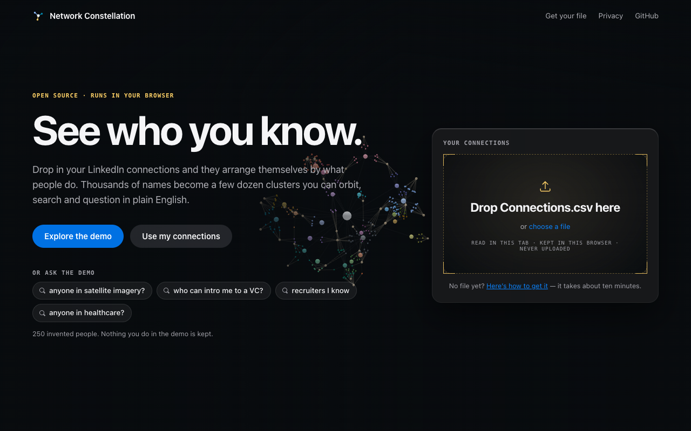

The constellation behind the page is the demo, already built and turning. Two
ways in:

- **Explore the demo** opens it. Nothing you do in the demo is kept, and it never
  overwrites a graph of your own.
- **Or ask the demo** runs one of the example questions, so you can see an
  answer straight away.

To use your own connections, keep reading.

## 2. Get your own export

LinkedIn will give you a copy of your own data. You don't need a password, a
browser extension or a scraper.

1. Open [Get a copy of your data](https://www.linkedin.com/mypreferences/d/download-my-data)
   (on LinkedIn: **Settings → Data privacy → Get a copy of your data**).
2. Choose **Want something in particular?** and tick **Connections**. Leave the
   rest unticked; nothing else is used.
3. Press **Request archive**. LinkedIn emails you when it is ready, usually
   within ten minutes.
4. Download the archive and unzip it. The file you want is `Connections.csv`.

Drop the CSV, not the zip. If you drop the whole archive, the page tells you to
unzip it first.

## 3. Drop it in

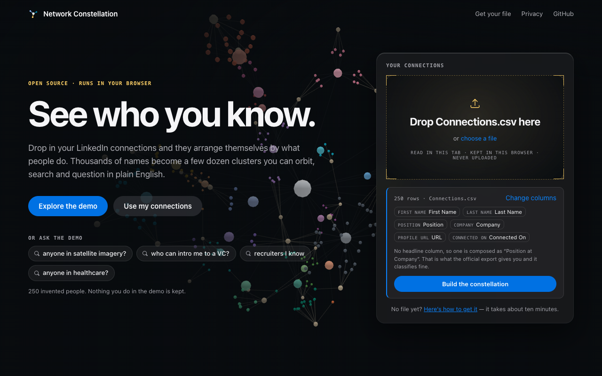

Drag `Connections.csv` onto the page, or press **choose a file**. The file is
read in that tab and kept in that browser. It is never uploaded anywhere.

The page shows how many rows it found and which column plays which part. The
official export has no headline, so one is composed as *Position at Company*,
which is what the classifier reads anyway. If your file is laid out
differently, press **Change columns** and say which is which. It needs a name
(or a first and last name), plus either a headline or a job title.

Press **Build the constellation**. A 10,000-person export takes a second or two.

> **Excel users:** if you opened the CSV in Excel and saved it again, save it as
> **CSV UTF-8**. A plain Windows CSV is read too, and the page says so, but UTF-8
> keeps every accented name intact.

## 4. Read the overview

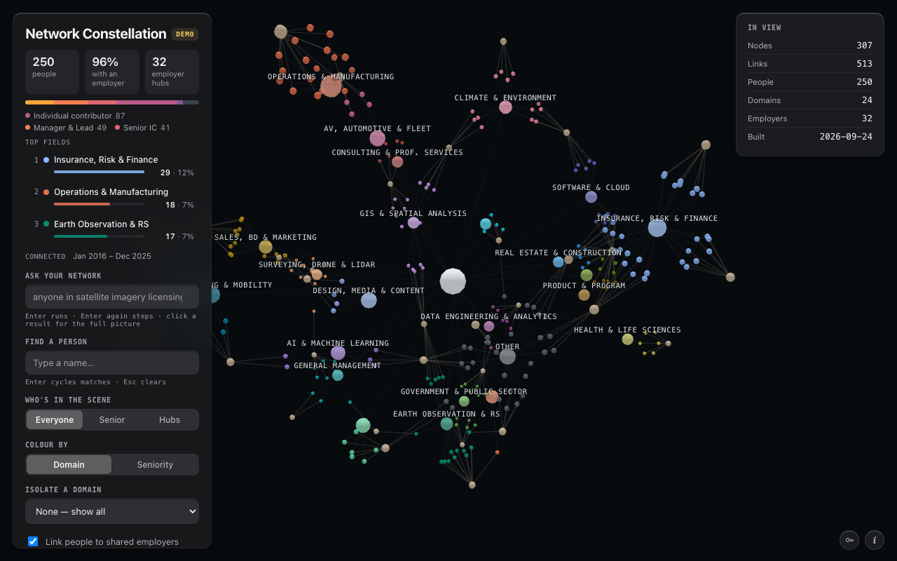

The top of the left panel describes the whole network:

- **People**, the share of them who **name an employer**, and the number of
  **employer hubs**: employers named by two or more of your connections.
- **Seniority** as one bar, most senior on the left. People who state no rank
  are grey. That is common, and it is a real category, not missing data.
- **Top fields**: the three largest clusters, with their share of your network.
- **Connected**: the span of dates you made these connections, when the export
  includes them.

The scene is the same information in space. Each person is a dot, pulled
towards the field their job puts them in (the labelled hubs) and towards any
employer they share with someone else. Colour is the field.

> The lines are **memberships, not relationships**. A line joins a person to a
> field or an employer, never two people to each other. LinkedIn does not share
> who knows whom. The **i** button in the bottom-right corner says so too.

## 5. Orbit, zoom and isolate a field

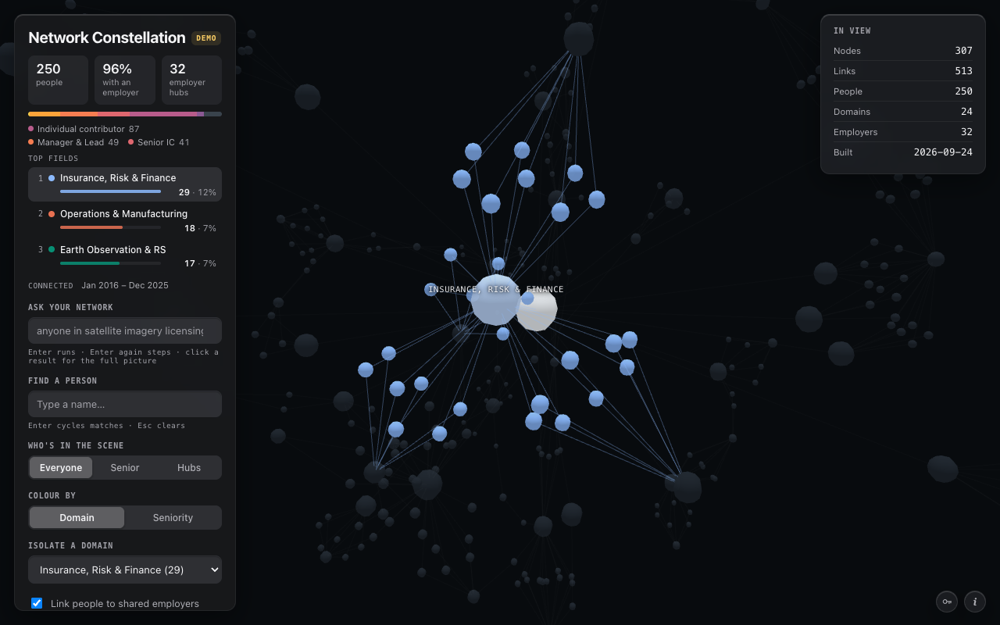

- **Drag** to orbit, **scroll** to zoom, **right-drag** to pan.
- **Click a top field** in the overview, a field's hub in the scene (the
  larger sphere under its label), or a row in the **Domains** legend to
  isolate that field. Click it again to bring everyone back.
- **Who's in the scene** thins the crowd: *Senior* keeps founders, C-suite,
  VPs, heads and directors, and *Hubs* keeps only the hubs.
- **Colour by → Seniority** repaints everyone by rank instead of field.
- Hover over anyone for their role and employer.

## 6. Find a person

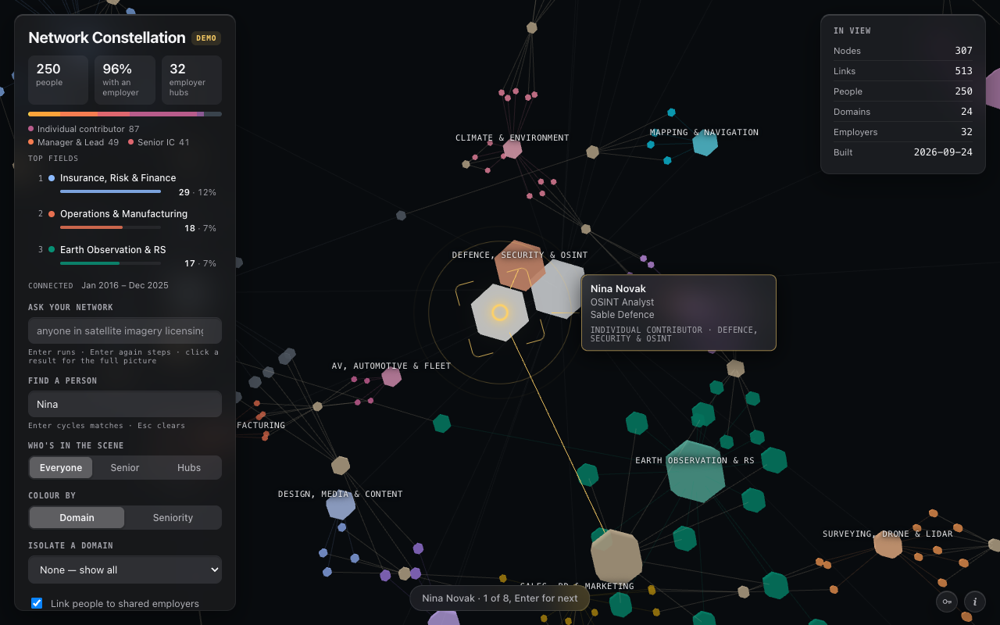

Type part of a name into **Find a person**. The camera swoops to the best match
and a marker locks onto it, so a single dot among thousands cannot be missed.
**Enter** steps through the other matches, and **Esc** clears the search.

## 7. Ask a question

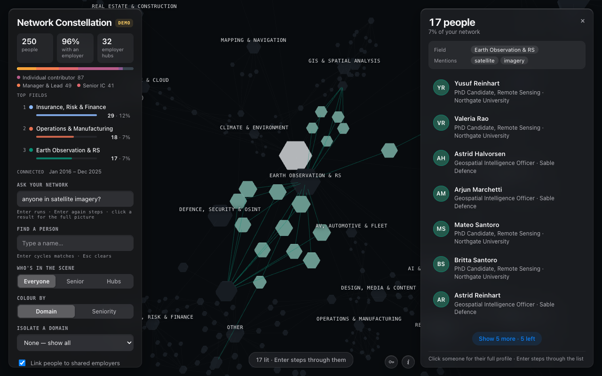

Type a question into **Ask your network** and press **Enter**. For example:

- *anyone in satellite imagery?*
- *who can intro me to a VC?*
- *senior people in insurance*
- *recruiters I know*

This runs on your own machine, in milliseconds, with no API key. The answer
panel shows:

- **How many people match**, and what share of your network that is.
- **How your question was read**: the field, role and words it matched on.
  This is shown on purpose. If the reading is wrong, rephrase using the words
  people put in their headlines.
- **The people**, best match first, with the matched words highlighted and
  the reasons each one qualified.

In the scene, the matches light up, everyone else dims, and the camera frames
the set. **Enter** again steps through the list one person at a time, **Show
more** reveals the next page, and **×** (or **Esc** in the question box) puts
the question away.

A question with nothing specific in it, such as *who do you know?*, gets no
answer rather than everyone. [How questions are answered](ask-your-graph.md)
explains the matching in full.

## 8. Open a profile

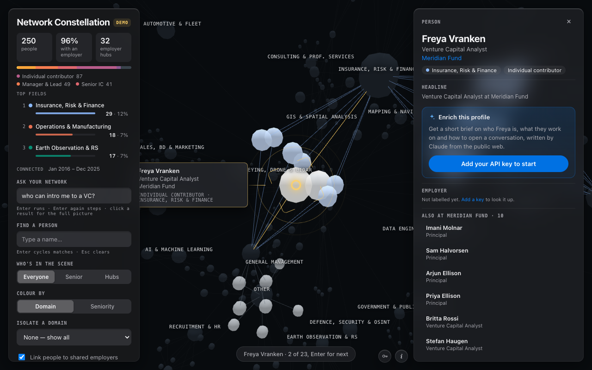

Click anyone, in the list or in the scene, to open their panel. The answer
steps aside while the panel is open, and comes back when you close it.

- Their **headline** as they wrote it, and their field and seniority.
- Their **employer**, and **everyone else you know there**. Click one of them
  to go to them.
- **When you connected**, and a **View on LinkedIn** link when your export
  includes profile links.

Click an employer hub in the scene for the employer's panel: how many of your
connections work there, their seniority mix, and who they are.

## 9. Add an API key (optional)

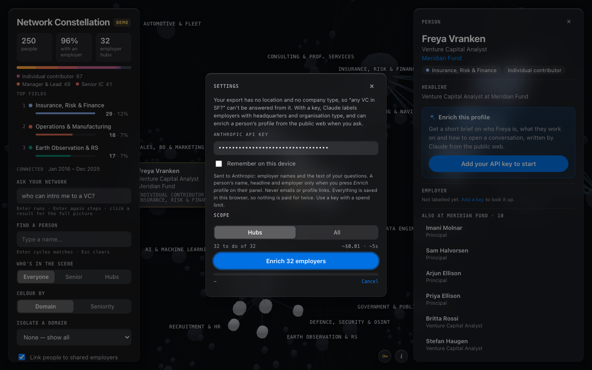

Everything so far worked without a key. A key adds three things, all run by
Claude through your own Anthropic account:

- **Where employers are based, and what kind of organisation they are**, so
  *any VC based in London?* can be answered.
- **A closer reading of each question**, which adds related words and fields.
  Anything Claude added is marked in the answer.
- **Enrich profile**, a researched brief on one person from the public web.

Open **Settings** with the key button at the bottom right and paste a key from
[the Claude Console](https://console.anthropic.com/settings/keys). Tick
**Remember on this device** only if you want the key kept in this browser. Use a
key with a spend limit.

The key is sent only to Anthropic, straight from your browser. What else goes
with it is listed in the panel and in the README's [privacy section](../README.md#privacy).

## 10. Enrich a profile

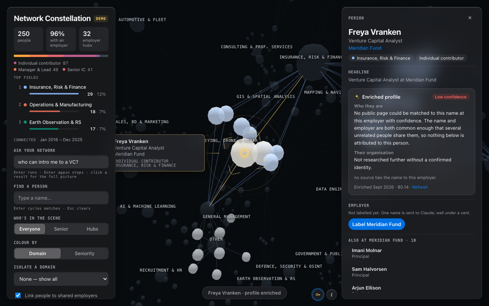

On a person's panel, press **Enrich profile**. Claude searches the public web
using that one person's name, headline and employer. This is the only thing
in the tool that ever sends a person's name, and it never runs unless you press
the button.

You get a short brief: who they are, what their organisation does, their track
record, and what they seem to care about now. It ends with three concrete ways
to open a conversation. The brief comes with its sources and a confidence
rating, and with a photo if a public page carries one. It usually costs
$0.10–$0.30, is saved in your browser, and costs nothing to look at again.
**Refresh** researches the person again.

The demo people are invented, so the brief above says the right thing: nobody
could be matched with confidence, so nothing is attributed to them. On a real
person, a namesake is the failure to watch for. The prompt treats a confident
brief about the wrong person as the worst possible outcome.

## 11. Enrich employers, then ask about a place

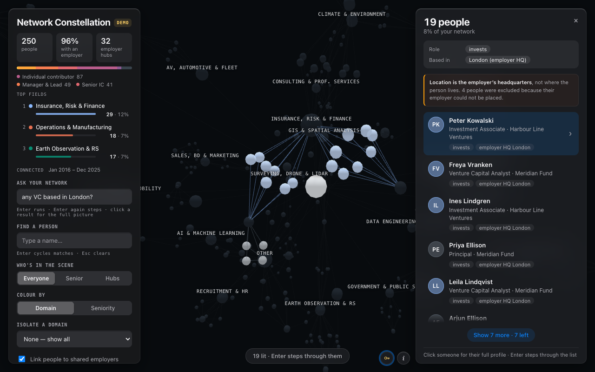

In **Settings**, choose a **scope**. **Hubs** covers the employers two or more
people share, and costs about $0.06 for a 10,000-person network. **All**
covers every employer named, about $0.70. Then press **Enrich employers**.
Results are saved in this browser, so nothing is paid for twice. **Cancel**
keeps whatever has already been done.

Then ask about a place: *any VC based in London?* Two things to know:

- **Location is the employer's headquarters**, not where the person lives. A
  London engineer at a San Francisco company matches *based in SF*. Every
  answer that uses location says so.
- **People whose employer could not be placed are left out**, and the answer
  says how many. A short list should never pass for a complete one.

## 12. Your data

At the bottom of the left panel:

- **Use another file** opens the landing page again. Drop a new export, or go
  back to your graph.
- **Forget** erases your graph, employer facts, research briefs and any
  remembered key from this browser. If another tab of the page is open, it
  waits and says so.

Your graph is kept in this browser's own storage (IndexedDB). It does not
follow you to another browser or device. Safari may clear storage for sites
you haven't visited in seven days, so if you use Safari, expect to drop the
file in again now and then.

## On a phone

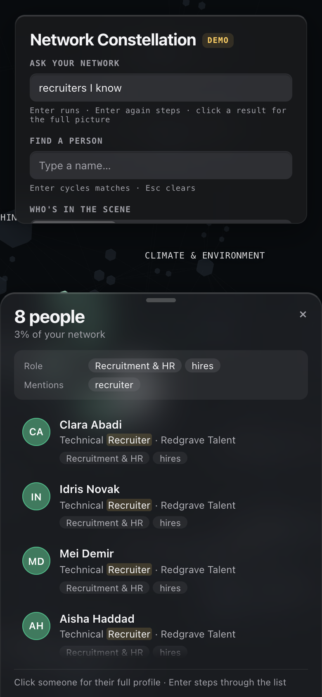

The answer and profile panels become a sheet at the bottom of the screen, with
the question box above. It is the same tool on a smaller window. For anything
long, a desktop is more comfortable.

---

Next: [Install and self-host](install.md) · [How questions are answered](ask-your-graph.md) · [Back to the README](../README.md)
